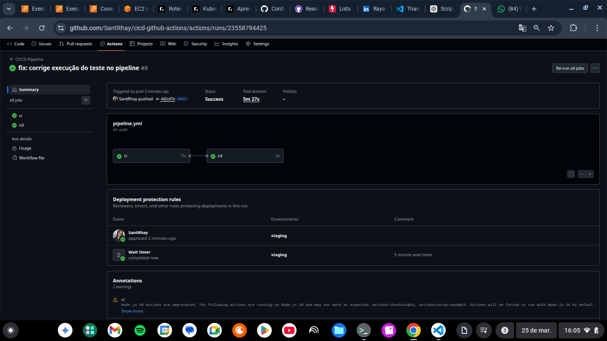

# CI/CD Pipeline com GitHub Actions

<p>
 
</p>

Projeto prático demonstrando a implementação de um pipeline completo de integração Contínua (CI) e Entrega Contínua (CD) utilizando GitHub Actions.

---

## 📌 Objetivo

Automatizar:

- 🧪 Execução de testes a cada push
- 🚀 Processo de deploy
- 🔐 Aprovação manual antes do deploy
- ⏱️ Controle de tempo com wait timer

---

## 🧱 Estrutura do Projeto

```bash
. 
├── app/ 
│    ├── index.js 
│    ├── test.js 
│    └── package.json  
├── .github/ 
│   └── workflows/ 
│       └── pipeline.yml 
├── README.md
```
---

## ⚙️ Tecnologia Utilizadas

- Node.js
- GitHub Actions
- YAML (Pipeline as Code)


---

## 🔄 Pipeline CI/CD

### 🏗️ Arquitetura da Pipeline

CI ⭢ Teste automatizados ⭢ Aprovação manual ⭢ Deploy (staging)

### 🧪 CI - Integração Contínua

- Executado a cada push na branch main
- Realiza:
    - Checkout do código
    - Setup do Node.js
    - Execução de testes automatizados

---

### 🚀 CD - Entrega Contínua

- Executando após sucesso do CI
- Inclui: 
      - Ambiente staging
      - Aprovação manual obrigatória
      - Wait timer antes do deploy
      - Simulação de deploy

---

## 🔐 Controle de Deploy 

O ambiente staging foi configurado com:

- ✔️ Aprovação manual
- ✔️ Proteção de ambiente
- ✔️ Delay controlado (wait timer)

---

## 🧪 Testes

Teste simples implementado para validar lógica da aplicação:

```bash
node test.js
```

---

## ▶️ Como Executar Localmente

```bash
cd app
npm run test
```

---

## ⚡ Como Funciona o Fluxo

1. Desenvolvedor faz git push

2. GitHub Actions inicia Pipeline

3. CI executa testes automatiicamente

4. Se aprovado:
    - CD aguarda aprovação manual

5. Após aprovação:
    - Deploy é executado

---

## 💼 Cenário Simulado 

Este projeto simula um fluxo real de DevOps onde:

- Código é validado automaticamente via testes
- Deploy exige aprovação manual (controle de risco)
- Existe controle de staging é protegido

---

## 📸 Pipeline em Execução




---

## 🧠 Aprendizados

- Criação de pipelines com GitHuub Actions
- Estrutura de CI/CD
- Uso de ambientes (staging)
- Controle de deploy com aprovação manual
- Debug de falhas em pipeline

---

## 🚀 Melhorias Futuras

- Deploy real em AWS EC2
- Containerização com Docker
- Integração com Slack para notificações
- Pipeline multi-ambiente (dev /staging /prod)

---

## 👩‍💻 Autora 

**Rayane Santana**

Projeto desenvolvido para fins de estudo e evolução na área DevOps